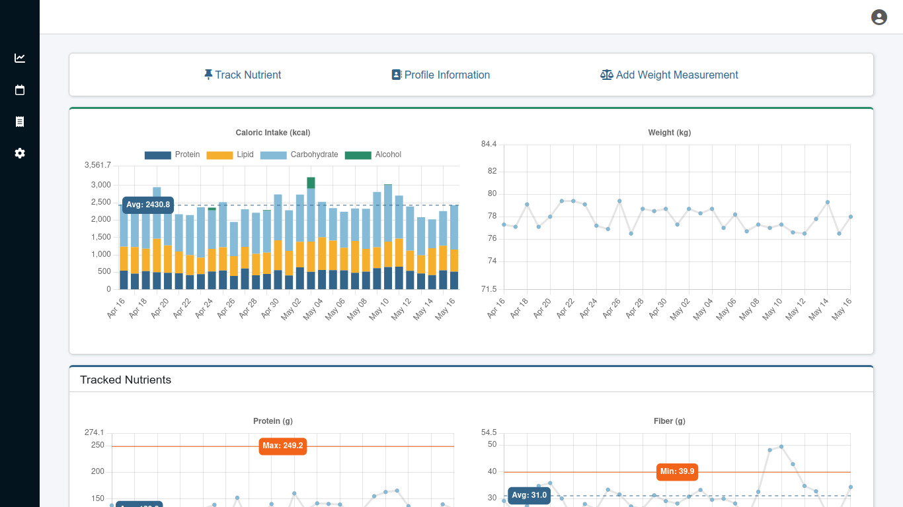
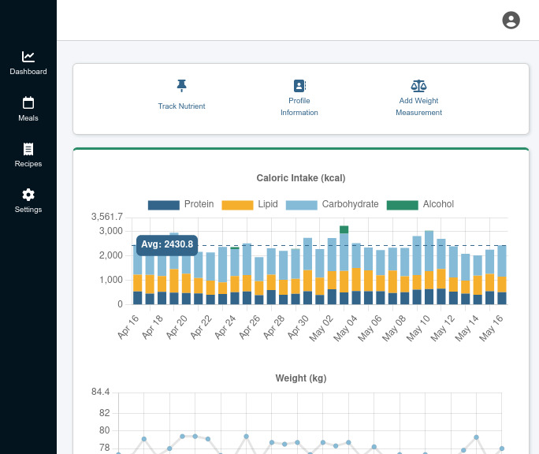
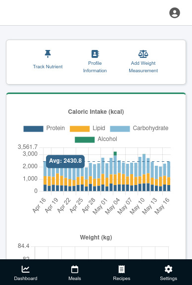
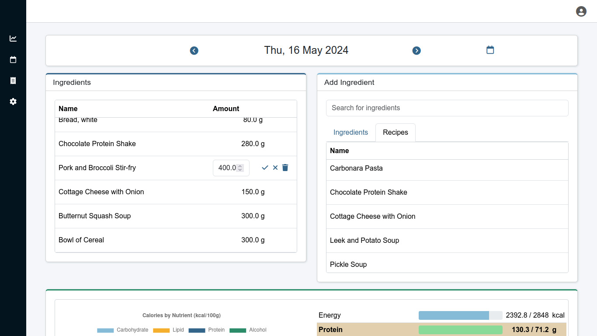
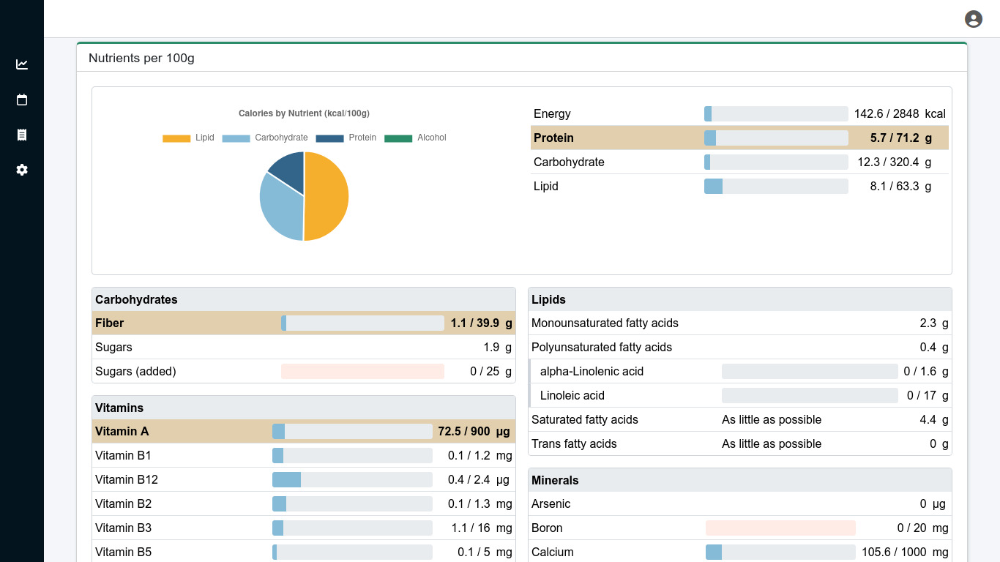

# Nutrition Tracker

[![License][license badge]][license]
[](https://docstr-coverage.readthedocs.io/en/stable/)
[](https://github.com/ambv/black)

An app for counting calories and tracking nutrient intake, built with Django, DRF and HTMX.
##### Table of Contents
- [Features](#Features)
- [Configuration](#Configuration)
- [Deployment](#Deployment)
- [Screenshots](#Screenshots)
- [Acknowledgements](#Acknowledgements)
## Features
- A dashboard where users can view:
	- A caloric intake chart with information about the caloric contribution of each macronutrient.
	- A weight chart.
	- Intake charts for tracked and under- and overconsumed nutrients.
- Intake recommendations for different demographics (sex and age). Recommendations can be constant values or relative to the user's weight or energy requirements.
- Meal diary with session based editing.
- User created recipes.
- Intake summaries for meals and recipes.
- Users can select nutrients to track. Tracked nutrients are highlighted in intake summaries and intake charts for the nutrients are displayed in the dashboard.
- Calculate the nutrients that are the most under- and overconsumed by the user.
- Browsable JSON API
##### Responive Design

 
##### Management commands
- `loadnutriendata` - Load built-in nutrient and intake recommendation data.
- `loadfdcdata` - Load food data from [FoodData Central csv files](https://fdc.nal.usda.gov/download-datasets.html).
	Currently, only the SR Legacy and FDNNS data types are supported. When using the full data, other data types are ignored.
- `clearemptymeals` - Remove empty meal diary records, that aren't currently edited.
## Configuration
The app can be configured through environment variables or a .env file in the project directory.

An example .env file, with all variables used by the app, could look like this:
```
# Django
SECRET_KEY=secret_key
DJANGO_SETTINGS_MODULE=nutrition_tracker.settings.prod
DJANGO_ALLOWED_HOSTS=0.0.0.0,127.0.0.1
DEBUG=False

# Email (Used for password resets)
EMAIL_HOST=smtp.gmail.com
EMAIL_PORT=587
EMAIL_HOST_USER=mail@example.com
EMAIL_HOST_PASSWORD=email_password
DEFAULT_FROM_EMAIL=mail@example.com
EMAIL_USE_TLS=True
EMAIL_USE_SSL=False

# Database
SQL_ENGINE=django.db.backends.postgresql
DB_NAME=nutrition_tracker_db
DB_USER=nutrition_tracker
DB_PASSWORD=app-db-user-password
DB_HOST=127.0.0.1
DB_PORT=5432

# Postgres
POSTGRES_PASSWORD=postgres-superuser-password
```
## Deployment
The project includes a configured Docker Compose application using a Gunicorn, Nginx and PostgreSQL stack. It can be deployed using the command:
```
docker compose -f docker/docker-compose.yml up -d
```

The .env file is used for configuration. Make sure that the file contains `SQL_ENGINE=django.db.backends.postgresql`, `DB_HOST=postgres` (the name of the PostgreSQL service) and a set `POSTGRES_PASSWORD` variable.

You can use
```
docker/init.sh
```
to perform a set of operations typically run when the application is started for the first time, such as:
- Collection of static files
- Database migration
- Creation of a superuser (interactive)
- Load data using the data commands (turned off by default, uncomment the appropriate statements in the file to turn on)
## Screenshots



## Acknowledgements
The built-in intake recommendation data is based on:
```
Institute of Medicine 2006.
Dietary Reference Intakes: The Essential Guide to Nutrient Requirements.
Washington, DC: The National Academies Press.
https://doi.org/10.17226/11537
```


[license badge]: https://img.shields.io/badge/License-MIT-brightgreen.svg
[license]: https://opensource.org/licenses/MIT
